# EITA50 Signal Processing

## Lab Report Instructions VT 2021

### General Instructions

The lab exercises in Signal Processing are usually performed physically in a lab room, with a teaching assistant helping the students and also approving them. In the Spring of 2021, the labs will instead be performed by each student at home. It will be done in the following way:

- Look at all the information on the course home page under the tab **"Laboratory Lessons."**
- Download and install Matlab on your computer.
- Download the Lab Manual, the data files, and the zip archive from the course home page.
- Read through the lab manual, perform all the steps of the lab, and document it in an electronic document.
- Upload your lab report in Canvas.
- Questions can be asked in your Canvas group.
- Note that there are hard deadlines for each lab; see the course home page.
- The lab reports must be in PDF and as short as possible.
- The report must be written in English.
- If your lab report is approved, you can see the result on the course home page about one week later, on the tab **"Results."**
- If your lab report is not approved, your teaching assistant will contact you via e-mail.

The lab reports should be as brief as possible, but you must provide answers to all questions, and the answers should contain motivations. When the task involves a plot, it should be included in the report.

All information and data can be found on the course Canvas pages (or department home pages: [www.eit.lth.se/course/eita50](http://www.eit.lth.se/course/eita50)).

---

### Lab 1 – A System for Recording

Read the entire lab text first. Then work yourself through the lab text again, perform all the tasks described, and write down answers for all the questions. Please make sure to answer all the following questions and give short motivations. Download the signal file `ekg1.mat` from the course home page.

#### Exercise 1

- Does the signal come from the real world or is it a simulation?

It comes from the real world. As the lab text says, the analog electrical signal was sampled at the Department of Cardiology, Lund University Hospital.

- Does the signal contain any noise?

Yes, the signal contains noise. The low-frequency noise is caused by the movement of the patient, such as breathing

- Include the plot of the raw signal.

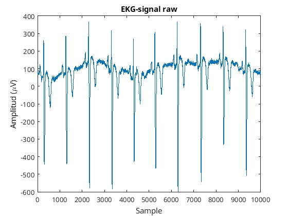

#### Exercise 2

- Does the file itself contain data that allows you to calculate the time interval of the recording?

No, the file itself does not contain data that allows you to calculate the time interval of the recording. We can only see the amount of samples

- What is missing for you to know that the recording is ten seconds?

The sampling frequency is missing. If we know the sampling frequency, we can calculate the time interval of the recording by dividing the number of samples by the sampling frequency. In our case, 10000 samples / 1000 sample frequency = 10 seconds.

- Include the plot with time scale on the $t$ axis.

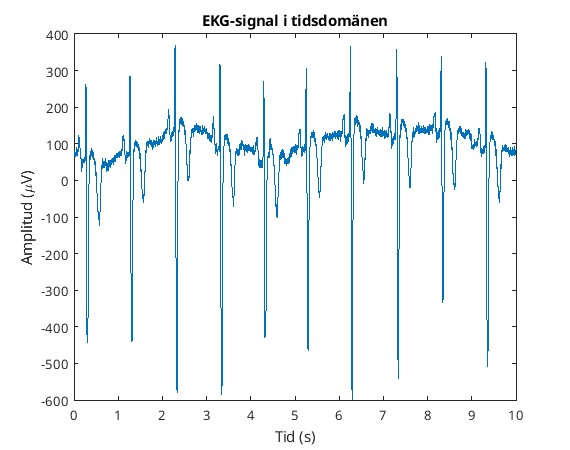

#### Exercise 3

- Does the signal mainly contain low, medium, or high frequencies?

Mainly low frequencies with the peak being at 0 Hz (not of interest to us), the peaks at 1, 3 and 4 Hz are more interesting. There are some peaks at medium frequencies as well, but not as strong as the low frequencies. The high frequencies are not prominent.

- What are the maximum frequencies that are interesting?

Around 50 Hz, because the human heart rate is generally much lower. Its technically possible to observe frequencies up to 500 (1000/2) Hz, but they are not of interest to us in this signal.

- What causes the higher frequencies?

Some parts of it are just noise, but other parts are just harmonics of the heart beat itself, which is not just a pure sinusoid.

#### Exercise 4

- What kind of filter are you implementing?

It has bounded memory because it looks at the 14 previous samples, and forgets anything before that. It has a finite impulse response, because the impulse response is zero after 14 samples. Therefore, it is a FIR filter.

##### Clarifying theory

I.e. FIR (Finate Impulse Response) Filters have bounded memory because inputs are calculated using only a limited number of recent input samples and since there is no feedback, a single impulse is bound to only affect the output for a finite amount of time.

Contrary, IIR (Infinite Impulse Response) Filters are recursive systems where the current output depends on both current/past inputs and previous output signals. Because old outputs are fed back into the system, a single input pulse can theoretically influence the output forever, giving it an infinite memory.

This is also why FIR filters are always stable, while IIR filters can be unstable if not designed properly.

- What is the filter called?

Moving average filter, which is a low-pass filter.

- Does the filter work as expected?

Yes, it decreases the noise

- How can you see this?

Less noise and more smooth signal, allowing us to see the larger patterns.

---

### Lab 2 – IIR Filter Design

Read the entire lab text first. Then work yourself through the lab text again, perform all the tasks described, and write down answers for all the questions. This lab uses the `mkiir` program, which is part of the zip archive.

#### Preparation Tasks

- Match the plots and give short motivations.

A -> 4, Because it lacks zeros to force the magnitude down to zero and its the only plot not reaching zero magnitude. Also, it has peaks around 0.125 normalized frequency (from $\omega = \pi/4$) which matches the peaks in the plot.

B -> 3, Because it has the same poles as A, but it also has zeros at the unit circle at f = 0 and f = 0.5 which forces the magnitude down to zero at those frequencies, which plot 3 clearly does.

C -> 1, Because the poles at normalized frequencies 0.25 which pushes the magnitude to 1 (and conjugate 0.75) as well as the zeros at around 0.3 which results in 0 magnitude in the corresponding plot.

D -> 2, Because this is a low pass filter where the lower frequencies of around 0 to 0.15 pass through whereas the magnitude quickly drops for larger frequencies, terminating at 0 for 0.5 (highest observable sample frequency according to nyqvist )

- Scan and include your plots.

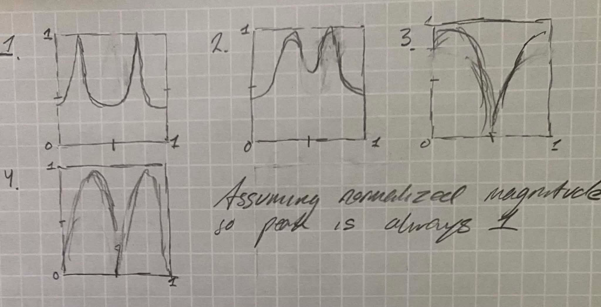

TODO

#### Exercise 1

- Explain what happens when you move the pole and zero around.

Moving the pole closer to the unit circle creates a sharp resonant peak, the closer to r=1 the larger the peak. The opposite hols for zeros, but creating a dip instead. Hoving around clock-wise or counter-clock-wise affects where on the x axis the peak or dip happens because that decides the normalized frequency via $f = \sigma/2\pi$.

- Explain the relationship between frequency response and angle and radius.

The angle dictates the placement and the radius dictades the bandwidth (how spiky).

- Include one or two example plots.

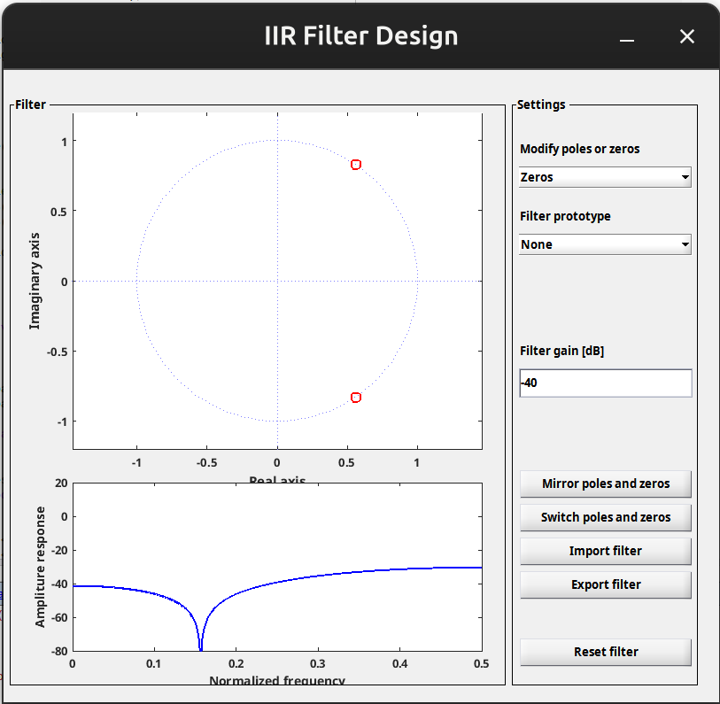
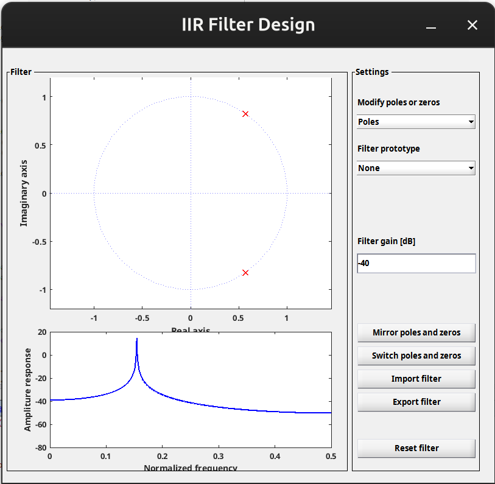
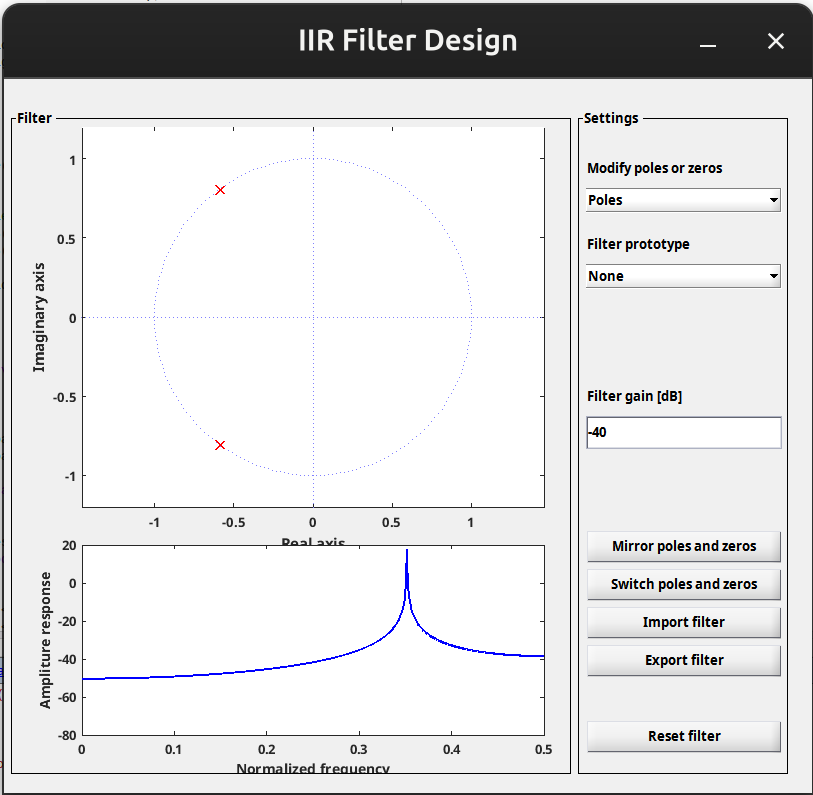

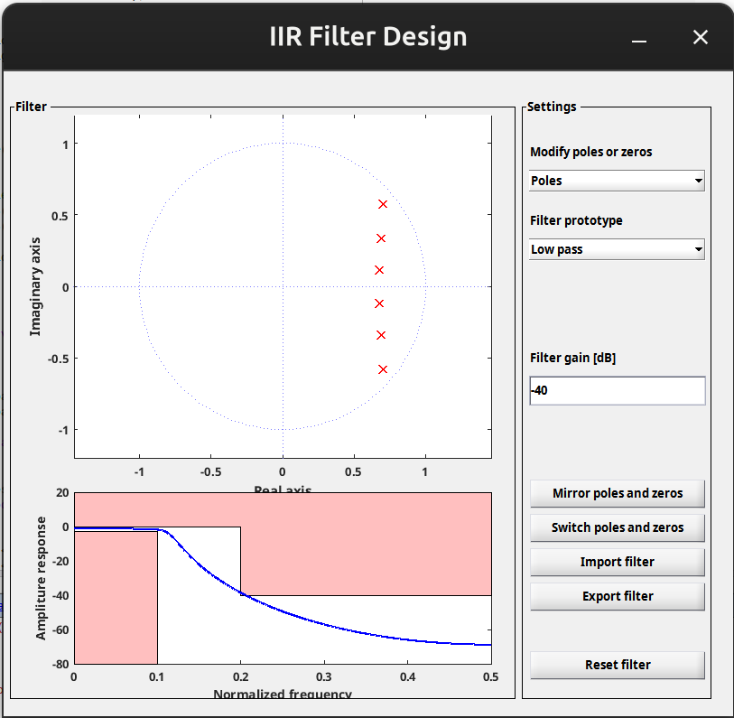

#### Exercise 2

- Use `mkiir` to design a good low pass filter.
- Include the plot.


- _Note:_ You may do the optional exercises, but do not include them in the lab report.

#### Exercise 3

- Listen to the signals and explain how the disturbances sound.

Multiple disturbances: 1. Grainy and noisy 2. High frequency beep

- Include the plots of the spectra and explain how you can see the disturbances.

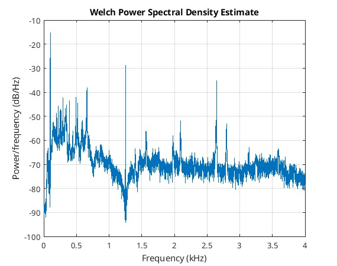

#### Exercise 4

- Design a notch filter to remove the disturbances.

```matlab
freq = [0.1 0.66 1.25 2.65] * 1000; % kHz

r = 0.95;
z = exp(-1j*2*pi*[freq , -freq]/fs);
p = exp(-1j*2*pi*[freq , -freq]/fs)*r;

b = poly(z);
a = poly(p);

y = filter(b, a, x);
```

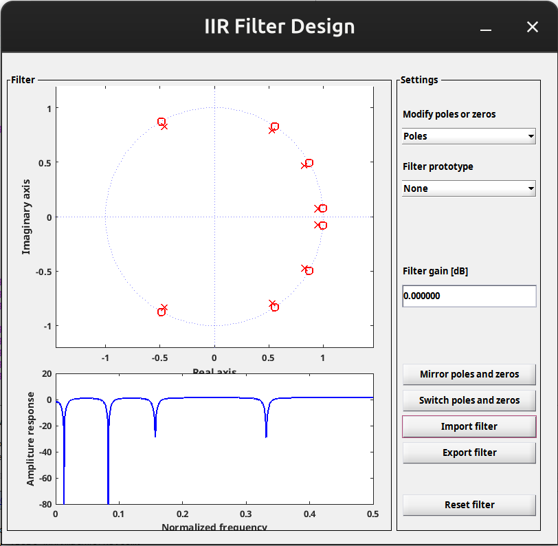

- Does the filter work as expected?

Yes

- How can you see it in the spectra?

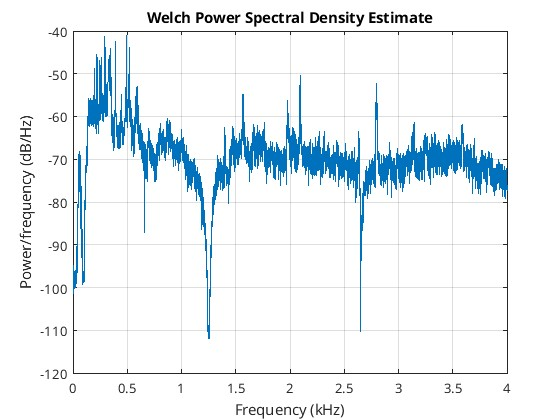

The sharp peaks have died down.

- How does the signal sound after being filtered?

Better, but still bad.

---

### Lab 3 – Image Filtering

Read the entire lab text first. Then work yourself through the lab text again, perform all the tasks described, and write down answers for all the questions. Download the file `grace-hopper.tif` from the course home page.

#### Exercise 1

- Look at the signal in Matlab.
- Apply the moving average filter.
- What effect does it have on the signal?

It smears/blurs the signal. It removes the sharp edges.

- What kind of filter is it?

Low-pass.

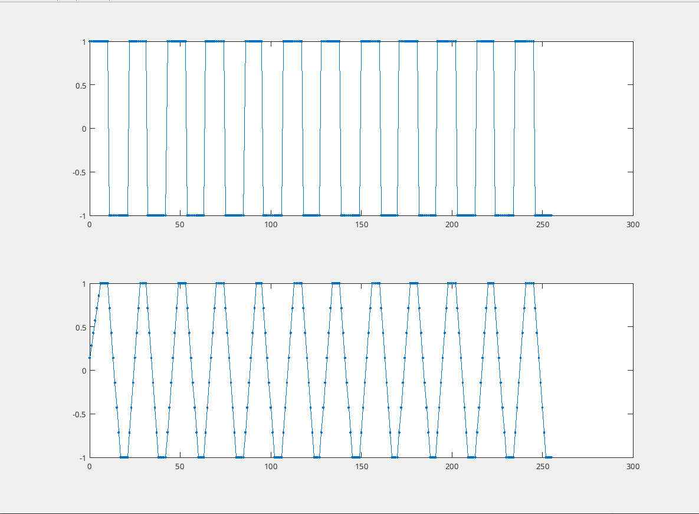

#### Exercise 2

- Apply the modified filter.
- What effect does it have on the signal?

It highlights change. It removes the constant background level (DC component) and slow moving trends. Instead, it lifts fast changes, spikes and highfrequency changes in the signal.

- What kind of filter is it?

High-pass

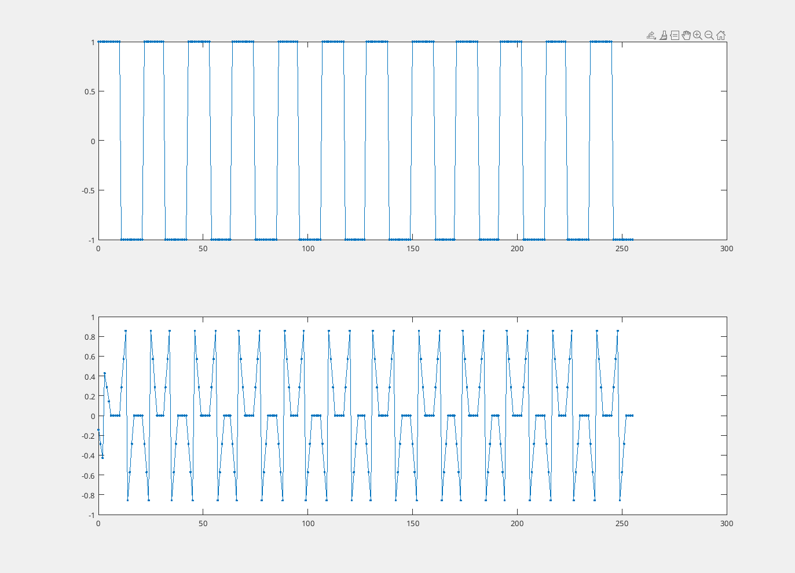

#### Exercise 3

- What type are the two filters?

The left one, h, is as said a low pass filter. We can see that by the filter design which is the same low value for all of the filter points. In its corresponding frequency response we see that low frequencies have the highest amplitude and higher frequencies (from above 0.2 normalized frequency and upwards) are muted.

The right one, g, is as said a high pass filter or an edge detector. It dampens the low frequencies and amplifies the high frequencies.

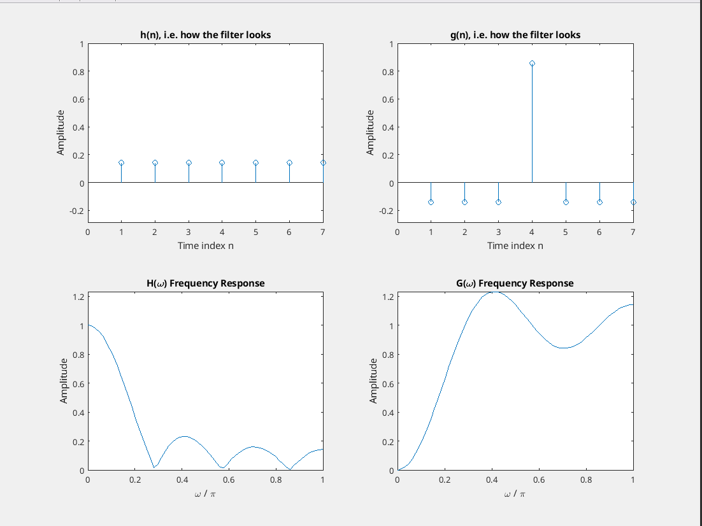

#### Exercise 4

- Look at the image in Matlab.
- Apply the two-dimensional moving average filter and look at the picture.
- What type of filter is this?

Its a 2D-low pass filter. Aka blur-filter or similar.

- What effect does it have on the picture?

It makes it blurry, and edges harder to detect.


#### Exercise 5

- Apply the filter to the picture and look at it.
- What type of filter is this?

Its a 2D-high-pass filter which is aka edge detector.

- What aspects of the picture does this filter bring out?

It brings out edges in the image.

- For what type of applications can edge detection be useful?

Image recognition in ML. Either we as humans can apply edge filters manually or the AI can construct them during training because it happens to be a useful step in computer vision.


#### Exercise 6

- What type are the two filters?

2D high pass and 2D low pass.

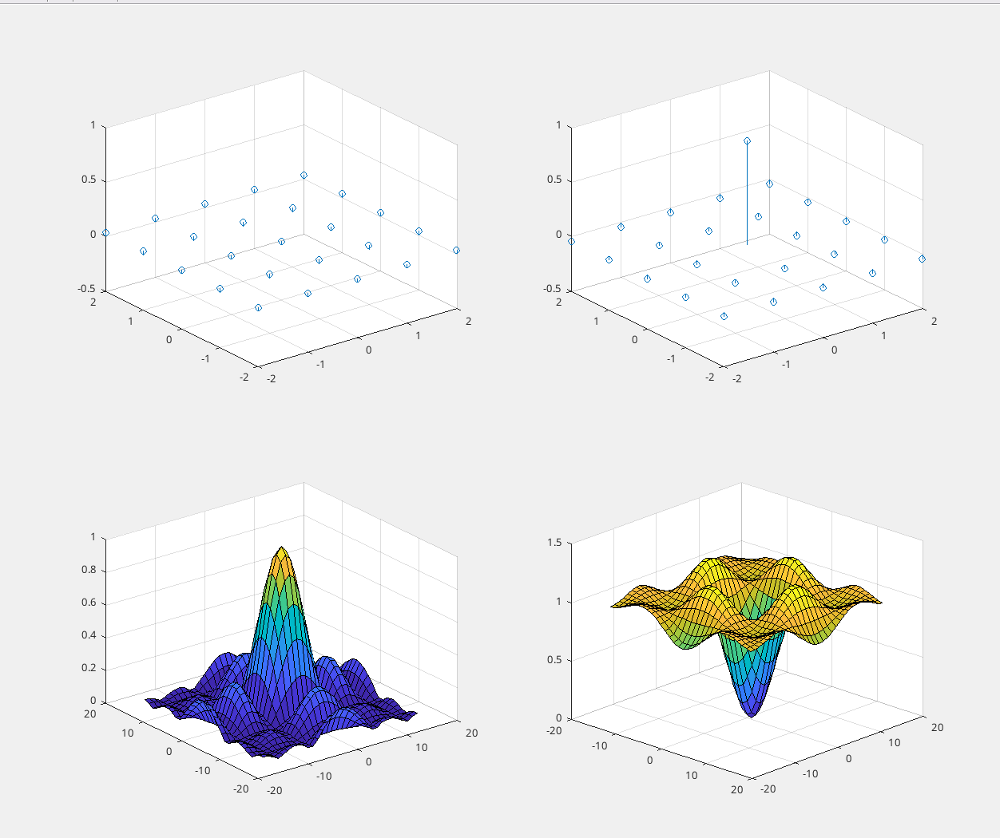
